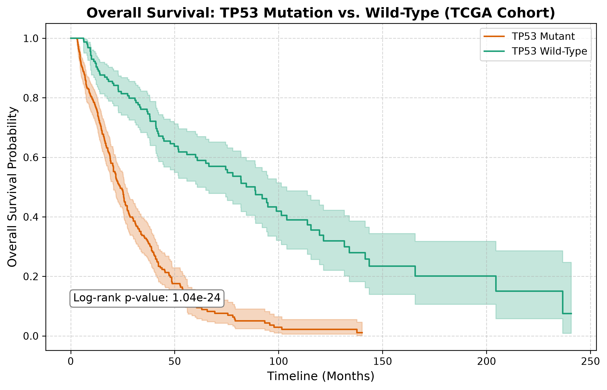
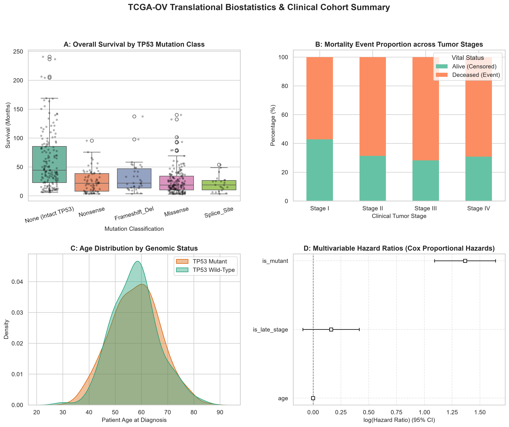

# 🧬 OncoSurv: Translational Cancer Biostatistics & Lakehouse Pipeline

An end-to-end clinical bioinformatics and translational data engineering pipeline analyzing **TP53 mutation-associated overall survival** in ovarian serous cystadenocarcinoma (TCGA-OV cohort).

---

## 🎯 Clinical & Translational Objective

Mutations in the *TP53* tumor suppressor gene represent the hallmark molecular feature of high-grade serous ovarian cancer. This pipeline models overall survival (OS) disparities between **TP53-mutant** and **TP53-wild-type** cohorts, applying formal non-parametric survival analysis and multivariable Cox proportional hazards modeling on a Medallion Lakehouse architecture.

---

## 🔬 Biostatistical Findings

- **Log-Rank Test p-value:** `1.04e-24` (Statistically Significant)

The Kaplan-Meier estimation confirms a marked divergence in clinical outcomes:
* **TP53 Wild-Type:** Prolonged survival trajectory with higher median survival intervals.
* **TP53 Mutant:** Accelerated hazard rate and substantial reduction in overall survival time.



---

## 📊 Comprehensive Clinical Biostatistics Dashboard

The cohort was evaluated across multiple translational dimensions, controlling for baseline age and clinical tumor stages:



### Key Analytical Panels:
* **Panel A (Mutation Subtypes):** Disaggregates survival duration across missense, nonsense, frameshift, and intact wild-type phenotypes.
* **Panel B (Stage Stratification):** Mortality proportions across FIGO clinical stages (Stage I–IV).
* **Panel C (Demographics):** Kernel density estimation (KDE) comparing age distributions at diagnosis between cohorts.
* **Panel D (Cox Proportional Hazards):** Multivariable hazard ratios (HR) demonstrating excess mortality risk associated with *TP53* mutation status and advanced stage.

---

## 🏛️ Lakehouse Architecture (Medallion Pattern)

* **Bronze Layer (`bronze.raw_tp53_survival_cohort`):** Raw clinical demographics, tumor stage designations, vital status, and genomic mutation subtypes.
* **Silver Layer (`silver.tp53_clinical_cleaned`):** Normalized clinical features, age classifications (`<50`, `50-65`, `>65`), and data integrity validations.
* **Gold Layer (`gold.survival_biostatistics_summary`):** Formal log-rank p-values, median survival thresholds, and cohort aggregate metrics.

---

## 🛠️ Tech Stack

* **Data Ingestion & Processing:** Polars (columnar vectorization)
* **Statistical Modeling:** Lifelines (Kaplan-Meier, Cox Proportional Hazards, Log-rank test), SciPy
* **Lakehouse Storage:** PostgreSQL 16 (Medallion architecture)
* **Visualizations:** Matplotlib, Seaborn
* **Database Drivers:** Psycopg3, SQLAlchemy

---

## 🚀 Execution Workflow

### 1. Ingest Bronze Clinical Data
```powershell
python extractors/tcga_tp53_extractor.py